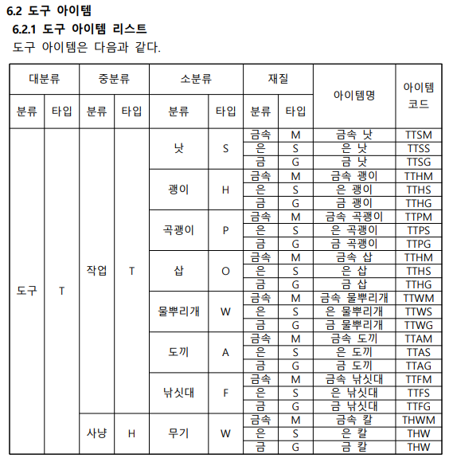
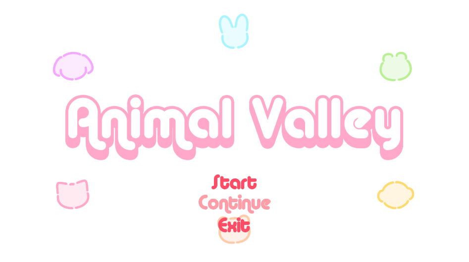
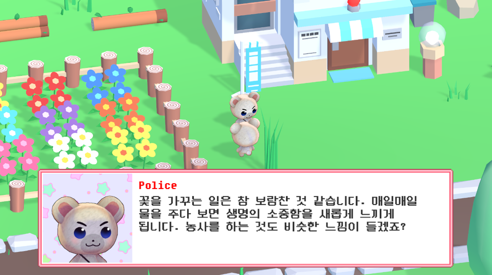
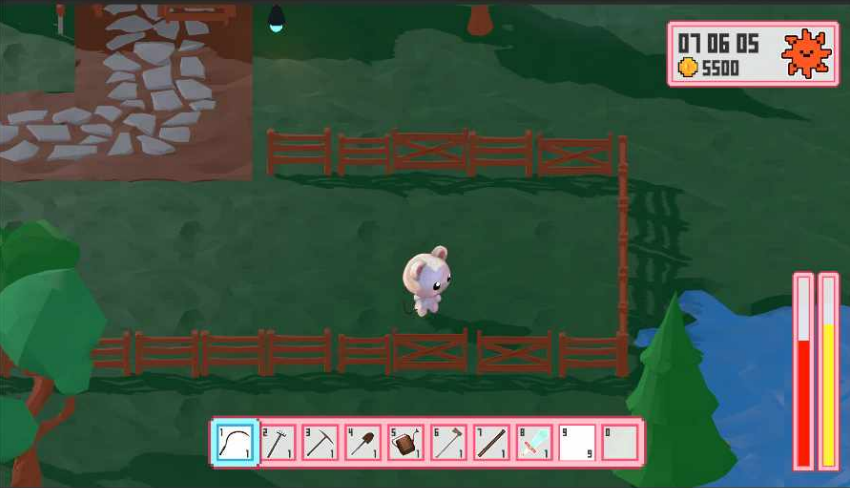

# AnimalValley

## AnimalValley

3D 프로그래밍 과목 프로젝트

동물들이 농사를 짓고 마을 사람들과 교류하는 AnimalValley 개발

담당한 것: 전체 시스템 설계 및 게임 데이터 관리

예시)  

 

## 구현 화면

 

 

 

## 배운 점

    
- 저장하기/불러오기 기능
    - 저장하기/불러오기 기능 구현
    - 자동 저장 기능 구현

- 아이템의 데이터베이스화
    - 아이템 코드를 부여하고 데이터베이스화 시킴

## 아쉬운 점

    
- 완성도
    - 계획했던 시스템 기능(저장/불러오기, 아이템 데이터베이스화, 시간 흐름) 개발은 예정대로 진행되었으나 캐릭터 조작 등의 기능의 완성도가 높지 않아, 실제로 시연 때 보여줄 수 있는 기능이 많이 없었다.

## 후기

- 기획 단계부터 꼼꼼하게 진행하여 개발을 진행했음
- 역할 분담으로 게임 시스템 개발에 집중할 수 있었음

 

## 기술 스택

| Unity | C# |
| :--------: | :--------: |
|      |       |

 

## 라이센스

MIT &copy; [ITJEONG](mailto:derbana1027@gmail.com)
